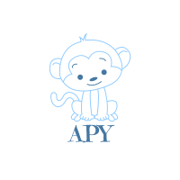
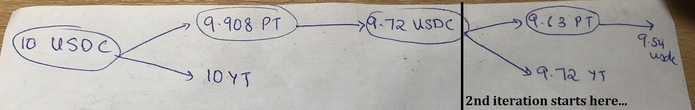

## Ape - YTC



Iteration 1: User deposits 10 USDC to get 9.9 PT and 10 YT. 9.9 PT sold for 9.7 USDC. 
Iteration 2: Deposit USDC back for more PT and YT. Sell PT for USDC and return to user.
(Iteration 2 is where the real magic happens)

This is called **Yield Token Compounding**.

At the end of i=2, user put in 10 USDC to get 19.72 YT and 9.54 USDC.

*Created as a part of ETHGlobal HackMoney*

## Product
* We wanted to add a UI to our automated YTC solution + real time YTC calculator. However, our front-end developer got covid and this couldn't be done
* As a result we came up with 2 products:
1. `scripts/ytc-test.js` -> this can be added into the ELF-SDK or used by bots or accessed via remix.
2. `scripts/ytcCalculator.js` -> A real time YTC calculator that takes into account slippage, trading fees across yearn, balancer, element.fi and current liquidity, interest rates on element.

* We wanted to include these into elf-sdk and use it more extensively, however due to time restrictions, we couldn't get it to work.

### YTC Contract
Step 1: SC approves Balancer vault on sending tranche tokens (aka Principal Tokens) on its behalf
Step 2: User approves SC to spend base tokens on its behalf
Step 3: User calls SC.compound() with relevant details.

This is an automated tool that drastically improves UX for YTC. Furthermore, it accounts for slippage too.

### Future Improvements
* Gas improvements
* More slippage protection
* Integrate `element-finance SDK`
* Better gas price prediction and inclusion into the final APR for the YTC Calculator.

## Instructions:
```
npm i
npx hardhat compile
```

This generates the ABI/artificats. This can be found in the `src/artifacts` directory.


To run scripts/or do transactions in goerli, you need to set 2 env variables (used by hardhat.config.js)
```
GOERLI_PROVIDER_URL = alchemy/infura
PRIVATE_KEY = the goerli pvt key you are using when running scripts as a signer!
```

### Element.fi contract addresses:
[`./goerli-constants.json`](./goerli-constants.json)
Alternatively use the elf-sdk.

### Hardhat stuff:
Run a hardhat node through:
```
npx hardhat node
```

Deploy contracts using:
```
npx hardhat run --network localhost scripts/deploy.js
```
Use any network defined in [`hardhat.config.js`](./hardhat.config.js)
Note that for this, you would need to first deploy Balancer pools, tranches, mint base tokens etc..

## Running a local mainnet fork (development environment)

### Required environment variables
1. copy default.env to .env
	```
	cp default.env .env
	```
2. Add your own values for the following:
	```
	GOERLI_PROVIDER_URL, MAINNET_PROVIDER_URL, PRIVATE_KEY
	```
3. And set REACT_APP_NETWORK accordingly:
	```
	REACT_APP_NETWORK=mainnet
	```
4. run ```source .env``` to load environment variables in every terminal instance that you are using

### Install dependencies
1. Run `npm install` for repository level dependencies
2. Run `cd frontend && npm install` for frontend dependencies

### Running a mainnet fork and rpc node
1. Run `hh clean` to remove all previous caching and build files (not necessary on first run)
2. Run `npm start` to build a new set of binaries, types, and to start the rpc node

### Running the frontend
1. Run `npm run frontend`

### Getting base tokens for testing
1. Wait for the mainnet fork rpc to be running
2. Run `hh run scripts/transferTokens.ts --network localhost`, and tokens will be added to your account

### Using the application
1. Visit localhost:3000 in browser
2. Add a new network to metamask, with rpc url: localhost:8545 and chainId: 31337 
3. If this is not the first time using the account. Reset the account by going to Settings -> Advanced -> Reset Account (This needs to be done every time you restart the rpc node)
4. Ensure that you are using the account for which you put the private key in the .env file
5. Use the app how you would any web3 application
